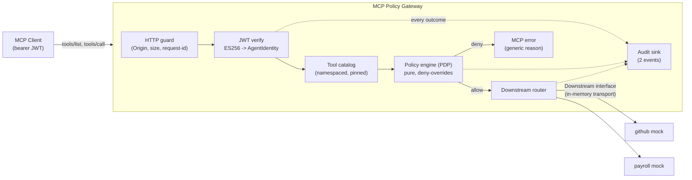
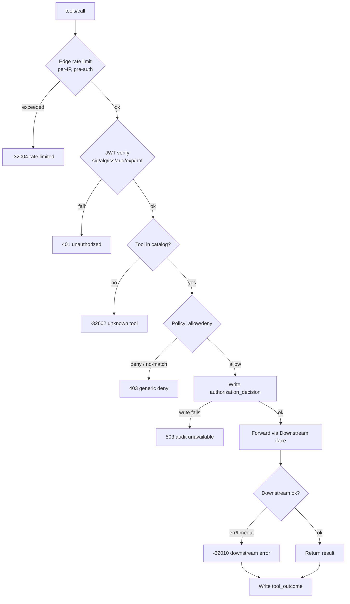
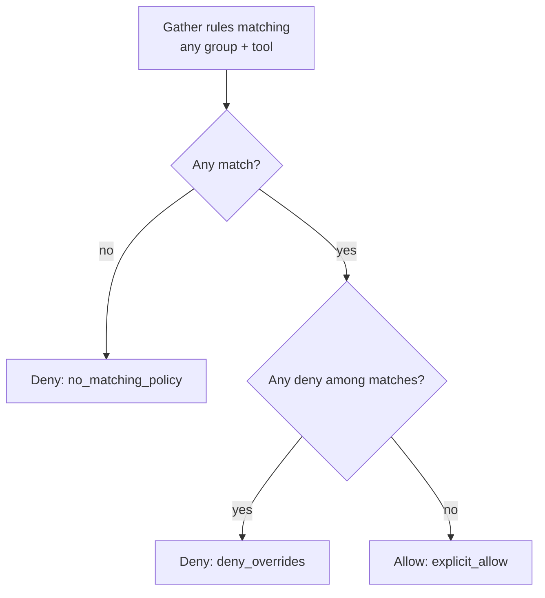

# MCP Policy Gateway

A small, security-first **MCP gateway** that sits between an MCP client and one or more
downstream MCP servers (GitHub, Payroll, ...) and enforces **allow/deny access-control
policies** on every tool call.

> **Design thesis:** make the authorization path *simple enough to prove, strict enough to
> trust, and modular enough to replace every take-home shortcut in production.*

The gateway is simultaneously an **MCP server** to callers and an **MCP client** to
downstreams. It authenticates the calling **agent** by verifying its **JWT** against a trusted
issuer, extracts the caller's user and groups into a verified `AgentIdentity`, resolves the
requested tool against a frozen catalog, evaluates a deterministic
**default-deny / deny-overrides** policy, writes an authorization audit record **before** any
side effect, and only then forwards the call.

---

## Table of contents

- [Core invariants](#core-invariants)
- [Architecture](#architecture)
- [Request lifecycle](#request-lifecycle)
- [Policy model](#policy-model)
- [Authentication & identity](#authentication--identity)
- [Error taxonomy](#error-taxonomy)
- [Audit model](#audit-model)
- [Downstream tools](#downstream-tools)
- [Configuration](#configuration)
- [Repository layout](#repository-layout)
- [How to run](#how-to-run)
- [Assumptions](#assumptions)
- [Design decisions](#design-decisions)
- [Scope: built vs documented](#scope-built-vs-documented)
- [Known limitations](#known-limitations)
- [What I would change for production](#what-i-would-change-for-production)
- [Security notes](#security-notes)

---

## Core invariants

These five properties hold on every request and are each backed by a test:

1. **Identity is verified once.** No handler reads raw JWT claims; only a verified
   `AgentIdentity` crosses the authentication boundary.
2. **Authorization is per invocation.** Filtering `tools/list` improves least privilege, but
   every `tools/call` is independently re-authorized against the same snapshot.
3. **Denial cannot cause a side effect.** A denied — or unauditable — request never reaches a
   downstream tool.
4. **Credentials do not transit trust boundaries.** The caller's token is audience-bound to
   the gateway and is **never** forwarded downstream.
5. **Configuration is evidence.** Every audit event carries the policy digest so a reviewer
   can reproduce the decision later.

---

## Architecture

The gateway is an MCP server to callers, a **policy enforcement point (PEP)** internally, and
an MCP client to each downstream. The **policy decision point (PDP)** is a pure, side-effect-
free function with no HTTP/JWT/MCP/logging dependencies — the single most important
testability choice in the design.



**Trust boundaries**

| Boundary | Untrusted input | Primary controls |
|---|---|---|
| Client → gateway | Headers, JSON-RPC body, JWT, tool name, args | TLS 1.3, Origin check, strict parsers, size limits, JWT verification, edge rate limit, deadlines |
| Config → gateway | YAML policy, keys, catalog lockfile | Read-only files, strict schema, digest, startup validation, last-known-good snapshot |
| Gateway → downstream | Tool definition drift, results, failures | Pinned catalog, explicit routing, separate identity, output bounds, timeout |
| Gateway → audit sink | Sensitive fields, sink outage | Field allowlist, redaction, fail-closed decision write |

---

## Request lifecycle

Ordered so the cheapest checks run first and no side effect can precede a recorded decision.



Every terminal box emits an audit record. Allowed calls produce **two** events
(`authorization_decision` before dispatch, `tool_outcome` after); all other paths produce a
single decision event.

---

## Policy model

Deterministic, order-independent, and small enough to prove exhaustively.

- **Default deny** — no matching rule means no authority.
- **Deny-overrides** — if any rule denies, the result is deny, regardless of matching allows
  or YAML order.
- **Matching** — a rule matches iff *(any of the principal's groups matches ∧ the tool
  matches)*. Tools support exact names and a single `*` wildcard; no regex.
- **Enforced twice** — `tools/list` is filtered to allowed tools; `tools/call` is re-checked.

### Evaluation



### Policy behavior (the four required cases)

| Scenario | Result | Reason code |
|---|---|---|
| No rule matches | **Deny** | `no_matching_policy` |
| Both allow and deny match (e.g. multi-group user) | **Deny** | `deny_overrides` |
| Tool not in catalog | **Deny** (client sees `-32602`) | `unknown_tool` |
| Invalid / expired / wrong-audience JWT | **Reject before policy** (client sees `401`) | `token_*` |

### Sample policy

```yaml
version: 1
defaults:
  effect: deny
  conflict_resolution: deny_overrides
policies:
  - id: engineering-github-read-create
    groups: [engineering]
    tools: [github.list_repositories, github.create_issue]
    effect: allow
  - id: engineering-deny-delete
    groups: [engineering]
    tools: [github.delete_repository]
    effect: deny
  - id: repository-admin-delete
    groups: [repository-admin]
    tools: [github.delete_repository]
    effect: allow
  - id: hr-payroll-read
    groups: [hr]
    tools: [payroll.get_employee]
    effect: allow
```

Conflict example: a user in **both** `engineering` and `repository-admin` calling
`github.delete_repository` matches one allow and one deny → **deny wins**, independent of rule
order.

---

## Authentication & identity

The gateway is an OAuth **resource server**, not an authorization server. It verifies the
agent's bearer **JWT** and constructs an immutable `AgentIdentity{ Subject, Issuer, Groups }`
— the only value that crosses the auth boundary. Verification lives behind a `TokenVerifier`
interface, so the identity source can later be an X.509 / SPIFFE SVID or verifiable credential
without touching the policy layer.

Mandatory checks (all must pass before an `AgentIdentity` exists):

- **Signature** using a configured **algorithm allowlist** — demo uses **ES256 (ECDSA P-256)**.
  `alg: none` and algorithm/key-family confusion are rejected.
- **Exact issuer** (`iss`) and **exact gateway audience** (`aud`) — a token minted for a
  downstream is not valid here.
- **`exp` / `nbf`** with a small injected-clock skew tolerance.
- **Non-empty `sub`**; **`groups`** parsed as a bounded, normalized, deduplicated string array.

**No token passthrough.** The inbound token is audience-bound to the gateway; downstream calls
use a **separate** service identity (or none, for in-process mocks). Forwarding the caller
token would create a confused-deputy problem and break resource isolation.

---

## Error taxonomy

Authentication/authorization failures are transport-level where supported; a tool that
actually executed and failed returns an MCP result with `isError=true`.

| Condition | Client sees | Disclosure policy |
|---|---|---|
| Missing / invalid / expired token | `401` | Generic `invalid_token` + request ID |
| Valid token, insufficient authority | `403` | **Generic** reason; policy IDs only in audit |
| Unknown tool (after auth) | JSON-RPC `-32602` | May name the requested tool; never disclose the downstream catalog. Authenticate-first + timing normalization limit enumeration |
| Malformed JSON-RPC / arguments | `400` / invalid-params | Point to schema path; never echo secrets |
| Downstream business error | `isError=true` | Sanitized message + request ID |
| Downstream unavailable / timeout | `-32010` / `503` | No internal hostnames, stacks, or credentials |
| Audit write fails before allowed call | `503` | `audit_unavailable`; call **not** forwarded |

---

## Audit model

One JSON line per event, stable field order, emitted from a `defer` so it fires even on panic.
**Two event types per allowed invocation**; a single decision event otherwise.

```json
{
  "timestamp": "2026-09-28T07:42:18.421Z",
  "event_type": "authorization_decision",
  "schema_version": 1,
  "request_id": "req_01K...",
  "principal": { "subject": "alice", "groups": ["engineering"], "issuer": "https://issuer.example" },
  "tool": "github.delete_repository",
  "downstream": "github",
  "decision": "deny",
  "reason": "explicit_deny",
  "matched_policy_ids": ["engineering-deny-delete"],
  "policy_digest": "sha256:9a1c...",
  "forwarded": false
}
```

Guarantees:

- **Never logs secrets** — no raw JWT, no full arguments (only an args fingerprint), no
  redacted values. Uses a strict field allowlist, not after-the-fact scrubbing.
- **`policy_digest`** ties each decision to the exact policy revision that produced it.
- Audit write failure never blocks the request path silently — the decision write is
  fail-closed; the outcome write alerts loudly.

---

## Downstream tools

Downstream servers expose local names (`list_repositories`); the gateway exposes
**namespaced** names (`github.list_repositories`) via an explicit route registry — routing
never depends on splitting a string at a `.`.

The take-home implements four tools behind a single `Downstream` interface, invoked over an
**in-memory MCP transport** (fast, deterministic, zero external processes). The identical code
path swaps to real downstream server processes in production without changing the gateway.

| Tool | Downstream | Behavior (mock) |
|---|---|---|
| `github.list_repositories` | github | Returns a static repo list |
| `github.create_issue` | github | Echoes the created issue |
| `github.delete_repository` | github | Returns what it *would* delete (no real deletion) |
| `payroll.get_employee` | payroll | Returns a mock employee record |

---

## Configuration

```yaml
# config/config.yaml (secrets come from env/files, never inline)
server:
  listen: "127.0.0.1:8080"
  endpoint: "/mcp"
  allowed_origins: ["http://localhost:6274"]
  max_body_bytes: 1048576
  request_timeout: 3s
auth:
  issuer: "https://demo-issuer.invalid"
  audience: "https://gateway.local/mcp"
  algorithms: ["ES256"]
  public_key_file: "testdata/keys/demo-ec-public.pem"
  clock_skew: 30s
  max_groups: 64
edge_rate_limit:
  requests_per_minute: 120   # per client IP, pre-auth
downstreams:
  - id: github
    namespace: github
  - id: payroll
    namespace: payroll
audit:
  path: "./var/audit.jsonl"
  fail_closed: true
```

---

## Repository layout

```
mcp-policy-gateway/
├── cmd/
│   ├── gateway/          # public MCP gateway (main)
│   ├── mint-token/       # demo-only ES256 JWT issuer utility
│   └── policyctl/        # validate, lint, and explain policy
├── internal/
│   ├── authn/            # TokenVerifier (JWT now; X.509/SVID/VC later) -> AgentIdentity
│   ├── policy/           # schema, compiler, PURE evaluator  <-- test centerpiece
│   ├── catalog/          # namespacing, canonicalization, lockfile
│   ├── gateway/          # MCP handlers, list-filtering, call pipeline
│   ├── downstream/       # Downstream interface + in-proc mocks
│   ├── ratelimit/        # edge (per-IP) limiter, interface for swap
│   ├── audit/            # typed events + JSONL sink
│   └── transportguard/   # Origin, size, headers, request ID
├── config/
│   ├── policies.yaml
│   └── config.yaml
├── testdata/keys/        # clearly-marked demo EC keys (public loaded by gateway)
├── .env.example          # placeholders only — NO secrets
├── Makefile
├── go.mod
└── README.md
```

Dependency rule that matters: **`internal/policy` imports nothing from `gateway`, `authn`, or
`downstream`.** It is a pure decision core; everything else is plumbing around it.

---

## How to run

> Planned commands (implementation lands in milestone 1+).

```bash
make test                      # unit + integration
make run-gateway               # start the gateway + in-proc mocks

# mint a demo token and call a tool
TOKEN=$(go run ./cmd/mint-token --sub alice --groups engineering --ttl 10m)
./scripts/demo.sh "$TOKEN"

# explain a decision without running the server
go run ./cmd/policyctl explain --user alice --groups engineering,repository-admin \
    --tool github.delete_repository

# lint the rulebase (shadowed / redundant / unreachable rules, broad wildcards)
go run ./cmd/policyctl lint

# security / regression gates
go test ./... && go test -race ./... && go vet ./...
```

---

## Assumptions

- An external identity provider already issues access tokens; the gateway only **verifies**
  them. The `sub` claim identifies the caller; `groups` supplies zero or more group names.
- Policies are authored by a trusted administrator and loaded from a local read-only path.
- Downstream mocks are in-process but are still treated as separate security domains with
  explicit catalogs and credentials.
- Tool calls are independent; the gateway keeps no user session and caches no authorization
  decision across calls.

---

## Design decisions

| Decision | Choice | Why |
|---|---|---|
| Language / transport | Go + streamable HTTP | Concurrent network service; typed; official MCP SDK; bearer-token model behind a load balancer |
| Identity | Verified JWT (`AgentIdentity`) behind `TokenVerifier` | Standard OAuth resource-server model; swaps to X.509 / SPIFFE SVID / VC without touching policy |
| Policy | Typed YAML + custom pure evaluator | Small, inspectable, deterministic; easy to unit-test |
| Default | Deny | Absence of a rule is a security decision, not an accident |
| Conflict | Deny-overrides | Order-independent and conservative across multiple groups |
| Discovery | Authorization-filtered `tools/list` | Least privilege + reduced agent confusion (call-time check still mandatory) |
| Routing | Explicit registry | Canonical identity; prevents prefix manipulation and collisions |
| JWT algorithm | ES256 (ECDSA P-256) | Modern asymmetric signature; avoids RS256's deprecated PKCS#1 v1.5 padding |
| Downstream | `Downstream` interface + in-memory transport | Proves protocol boundary without extra processes; swaps to real servers in prod |
| Rate limiting | Edge-only (per-IP, pre-auth) | Protects against unauthenticated floods + JWT-verify CPU burn; deeper tiers documented |
| Audit | Decision before dispatch, outcome after | No unaudited side effects; separates authorization from execution |

---

## Scope: built vs documented

Kept deliberately small per the assignment ("prefer a smaller, well-designed implementation").

| Built in take-home | Documented as production evolution |
|---|---|
| Go gateway + in-proc mock tools | Real downstream server processes; service mesh / mTLS identity |
| JWT verification (`AgentIdentity`) behind `TokenVerifier` | X.509 / SPIFFE SVID or W3C verifiable-credential identities; identity lifecycle (issue/renew/revoke) |
| Static demo ES256 key + mint-token utility | JWKS discovery, key rotation, introspection, revocation |
| YAML policy loaded at startup + SIGHUP reload | Signed policy bundles, approval workflow, central control plane |
| Default-deny + deny-overrides (group + tool) | Argument-level **ABAC** and delegated authorization |
| Authorization-aware `tools/list` | Dynamic catalog subscriptions, distributed cache |
| Catalog lockfile (SHA-256 digests) | Signed attestations / provenance chain |
| Synchronous JSONL audit | Durable WAL, event pipeline, tamper-evident retention |
| Edge rate limit (per-IP) | Per-identity quotas, distributed limiter, output **redaction** |
| Rulebase hygiene: `policyctl lint` + per-rule hit counters | Richer identity claims (assurance level, key-binding); policy simulation harness |
| Unit, integration, race tests | Continuous adversarial + chaos testing |

---

## Known limitations

- Static/demo verification key; no real IdP or JWKS.
- Startup-loaded policy (plus SIGHUP reload); no signed bundle or approval flow.
- Local JSONL audit; not durable or tamper-evident.
- In-process mock downstreams; no real network, mTLS, or circuit breakers.
- Tool-level policy only; **no argument-level ABAC** and **no output redaction** (both
  designed for and documented, not built).
- Per-instance edge rate limit only; no distributed quota.

None of these change the core decision ordering or default-deny semantics.

---

## What I would change for production

- **Policy engine** — keep the `PolicyEvaluator` interface but consider OPA/Rego or Cedar for
  policy-as-code, decision logs, and richer conditions; version and sign policy bundles.
- **Credential handling** — token exchange / on-behalf-of so downstreams receive a fresh
  audience-bound token (or the gateway's own mTLS identity), never the caller's token.
- **AuthN** — multi-issuer JWKS with bounded refresh + last-known-good; audience per resource;
  optional mTLS-bound or DPoP tokens.
- **Identity formats & lifecycle** — support X.509 / SPIFFE SVID or verifiable-credential
  identities behind the same `TokenVerifier`, with certificate-bound (mTLS/DPoP) tokens for
  proof-of-possession, and issue / renew / revoke handled by the trusted issuer.
- **Rate limiting** — per-identity quotas and a distributed limiter, with local emergency
  limits retained.
- **Downstream I/O** — real MCP transports with pooling, retries (idempotency-aware),
  circuit breakers, and health checks.
- **Audit** — durable WAL → partitioned SIEM sink, hash-chained/signed batches, retention and
  PII governance.
- **Observability** — OpenTelemetry traces/metrics, deny-rate alerts, latency histograms.
- **Rollout** — shadow/dry-run mode and canaries for safe policy changes.

---

## Security notes

Applies the workspace security guidance directly:

- **No hardcoded credentials.** JWT keys, downstream tokens, and any secret material come from
  files or environment variables. The repo ships only a clearly-marked **public** demo EC key
  and a `.env.example` with placeholders; the gateway never loads a private signing key.
- **Modern cryptography.** Signatures use **ES256 (ECDSA P-256)** — RS256 (RSASSA-PKCS#1 v1.5)
  is avoided as deprecated. Transport enforces **TLS 1.3 only** outside local dev; a
  hybrid post-quantum KEX (e.g. `X25519MLKEM768`) is the documented production path. `alg: none`
  and algorithm-confusion are rejected. No MD5/SHA-1 anywhere.
- **Certificates.** Any X.509 material (mTLS in production) must be verified for expiry,
  key strength (≥ 2048-bit RSA or P-256), SHA-256 signatures, and self-signed only for dev.
