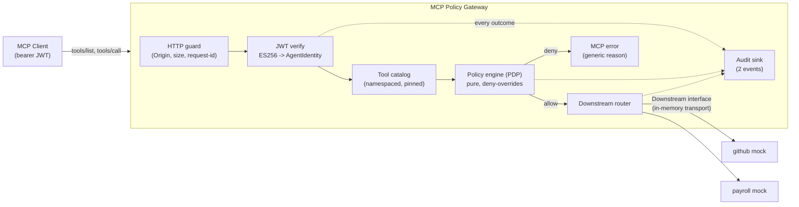
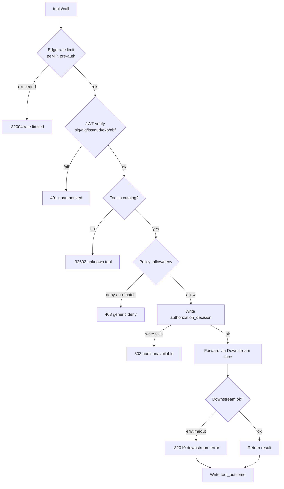
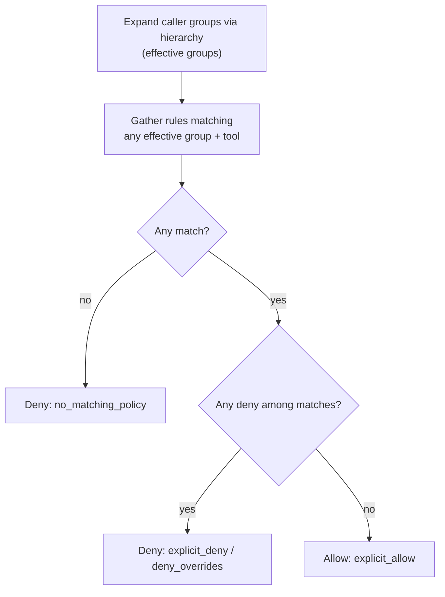

# MCP Policy Gateway

A small MCP gateway that sits between an MCP client and one or more downstream MCP servers
(GitHub, Payroll, ...) and enforces allow/deny access-control policies on every tool call.

The gateway is an MCP server to callers and an MCP client to downstreams. On each request it
verifies the caller's JWT against a trusted issuer, extracts the subject and groups into a
verified `AgentIdentity`, resolves the requested tool against a fixed catalog, evaluates a
default-deny / deny-overrides policy, writes an authorization audit record before any side
effect, and only then forwards the call.

---

## Table of contents

- [Core invariants](#core-invariants)
- [Architecture](#architecture)
- [Request lifecycle](#request-lifecycle)
- [Policy model](#policy-model)
- [Authentication & identity](#authentication--identity)
- [Error taxonomy](#error-taxonomy)
- [Audit model](#audit-model)
- [Downstream tools](#downstream-tools)
- [Configuration](#configuration)
- [Repository layout](#repository-layout)
- [How to run](#how-to-run)
- [Assumptions](#assumptions)
- [Design decisions](#design-decisions)
- [Scope: built vs documented](#scope-built-vs-documented)
- [Known limitations](#known-limitations)
- [What I would change for production](#what-i-would-change-for-production)
- [Security notes](#security-notes)

---

## Core invariants

These five properties hold on every request and are each backed by a test:

1. **Identity is verified once.** No handler reads raw JWT claims; only a verified
  `AgentIdentity` crosses the authentication boundary.
2. **Authorization is per invocation.** Filtering `tools/list` improves least privilege, but
  every `tools/call` is independently re-authorized against the same snapshot.
3. **Denial cannot cause a side effect.** A denied — or unauditable — request never reaches a
  downstream tool.
4. **Credentials do not transit trust boundaries.** The caller's token is audience-bound to
  the gateway and is **never** forwarded downstream.
5. **Configuration is evidence.** Every audit event carries the policy digest so a reviewer
  can reproduce the decision later.

---

## Architecture

The gateway is an MCP server to callers, a policy enforcement point (PEP) internally, and an
MCP client to each downstream. The policy decision point (PDP) is a pure, side-effect-free
function with no HTTP/JWT/MCP/logging dependencies, which is what makes it straightforward to
test exhaustively.




**Trust boundaries**


| Boundary             | Untrusted input                              | Primary controls                                                                                 |
| -------------------- | -------------------------------------------- | ------------------------------------------------------------------------------------------------ |
| Client → gateway     | Headers, JSON-RPC body, JWT, tool name, args | TLS 1.3, Origin check, strict parsers, size limits, JWT verification, edge rate limit, deadlines |
| Config → gateway     | YAML policy, keys, catalog lockfile          | Read-only files, strict schema, digest, startup validation, last-known-good snapshot             |
| Gateway → downstream | Tool definition drift, results, failures     | Pinned catalog, explicit routing, separate identity, output bounds, timeout                      |
| Gateway → audit sink | Sensitive fields, sink outage                | Field allowlist, redaction, fail-closed decision write                                           |


---

## Request lifecycle

Ordered so the cheapest checks run first and no side effect can precede a recorded decision.




Every terminal box emits an audit record. Allowed calls produce **two** events
(`authorization_decision` before dispatch, `tool_outcome` after); all other paths produce a
single decision event.

---

## Policy model

Deterministic, order-independent, and small enough to test exhaustively.

- **Default deny** — no matching rule means no authority.
- **Deny-overrides** — if any rule denies, the result is deny, regardless of matching allows
or YAML order.
- **Matching** — a rule matches iff *(any of the caller's **effective** groups matches ∧ the
tool matches)*. Effective groups = the caller's own groups plus everything they inherit
through the optional group hierarchy (see below). Tools support an exact name, a namespace
wildcard (`github.*`), or the full wildcard (`*`); no regex.
- **Enforced twice** — `tools/list` is filtered to allowed tools; `tools/call` is re-checked.

### Nested groups (hierarchy)

Groups may be arranged in a hierarchy so a grant made to a broad group is inherited by nested
teams, without duplicating rules. Each group lists the `parents` it is nested within;
membership is inherited **transitively and downward only** (a member of a child is a member of
its parents, never the reverse).

```yaml
groups:
  - name: engineering
    parents: [staff]
  - name: senior-engineering
    parents: [engineering]   # -> engineering -> staff
  - name: hr
    parents: [staff]
```

A caller whose token carries only `senior-engineering` is evaluated as
`{senior-engineering, engineering, staff}`. Semantics that fall out of this, all covered by
tests (`internal/policy/nested_test.go`):

- Inherited allow: a child inherits a parent's allow (`senior-engineering` gets `staff`'s grants).
- Inherited deny-overrides: a deny on a parent still wins against an allow on the child.
- Downward only: a parent never inherits a child's grants.
- Sibling isolation: siblings share only common ancestors, not each other's grants.
- Diamond inheritance: multiple paths to a shared ancestor are de-duplicated.
- Cycles are rejected at load time (fail closed).

The hierarchy is optional; with no `groups:` section, groups are flat exact-match. The hierarchy
is folded into the policy digest, and `policyctl explain` prints the resolved effective groups.

### Evaluation




#### Evaluation engine (bitset inverted index)

`Evaluate` runs on an inverted index of bitsets that the loader builds once per (immutable)  
snapshot: `group → ruleset`, `tool/namespace → ruleset`, plus global `allow`/`deny` masks. A  
decision is then set algebra: `candidates = (⋃ groups) ∩ (tool)`, then `deny = candidates ∩
denyMask`. That is a few word-wise OR/AND operations instead of a per-rule loop, so cost scales
with the number of matching rules rather than the total rule count. Deny-overrides reduces to
"the intersection with the deny mask is non-empty".

A differential property test (`index_test.go`) runs thousands of random requests through the
engine and checks each `Decision` (including the order of matched rule IDs) against an
independent, deliberately naive linear evaluator that lives in the test package only. That keeps
the bitset code honest without shipping a second evaluator. Benchmarks (`make bench`, Apple M4 Pro):


| Rules  | Indexed | Naive scan (reference) | Speedup |
| ------ | ------- | ---------------------- | ------- |
| 100    | 78 ns   | 849 ns                 | ~11×    |
| 1,000  | 166 ns  | 8.5 µs                 | ~51×    |
| 10,000 | 724 ns  | 84 µs                  | ~116×   |


For very large / sparse rule sets the plain bitsets would be swapped for Roaring bitmaps and a
per-decision cache added; the interfaces do not change.

### Policy behavior (the four required cases)


| Scenario                                          | Result                                       | Reason code          |
| ------------------------------------------------- | -------------------------------------------- | -------------------- |
| No rule matches                                   | **Deny**                                     | `no_matching_policy` |
| Both allow and deny match (e.g. multi-group user) | **Deny**                                     | `deny_overrides`     |
| Tool not in catalog                               | **Deny** (client sees `-32602`)              | `unknown_tool`       |
| Invalid / expired / wrong-audience JWT            | **Reject before policy** (client sees `401`) | `token_*`            |


### Sample policy

```yaml
version: 1
defaults:
  effect: deny
  conflict_resolution: deny_overrides
groups:
  - name: engineering
    parents: [staff]
  - name: senior-engineering
    parents: [engineering]
  - name: hr
    parents: [staff]
policies:
  - id: staff-github-read           # inherited by engineering, hr, senior-engineering
    groups: [staff]
    tools: [github.list_repositories]
    effect: allow
  - id: engineering-github-create
    groups: [engineering]
    tools: [github.create_issue]
    effect: allow
  - id: engineering-deny-delete
    groups: [engineering]
    tools: [github.delete_repository]
    effect: deny
  - id: repository-admin-delete     # standalone group: not nested under engineering
    groups: [repository-admin]
    tools: [github.delete_repository]
    effect: allow
  - id: hr-payroll-read
    groups: [hr]
    tools: [payroll.get_employee]
    effect: allow
```

Inheritance example: an `engineering` caller inherits `staff`'s `github.list_repositories` grant
without a dedicated rule.

Conflict example: a user in **both** `engineering` and `repository-admin` calling
`github.delete_repository` matches one allow and one deny → **deny wins**, independent of rule
order. (`repository-admin` is deliberately *not* nested under `engineering`, so a pure
repository-admin can still delete.)

---

## Authentication & identity

The gateway is an OAuth **resource server**, not an authorization server. It verifies the
agent's bearer **JWT** and constructs an immutable `AgentIdentity{ Subject, Issuer, Groups }`
— the only value that crosses the auth boundary. Verification lives behind a `TokenVerifier`
interface, so the identity source can later be an X.509 / SPIFFE SVID or verifiable credential
without touching the policy layer.

Mandatory checks (all must pass before an `AgentIdentity` exists):

- Signature against a configured algorithm allowlist (demo uses ES256 / ECDSA P-256).
`alg: none` and algorithm/key-family confusion are rejected.
- Exact issuer (`iss`) and exact gateway audience (`aud`): a token minted for a downstream is
not valid here.
- `exp` / `nbf`, with a small injected-clock skew tolerance.
- Non-empty `sub`; `groups` parsed as a bounded, normalized, deduplicated string array.

No token passthrough: the inbound token is audience-bound to the gateway; downstream calls use a
separate service identity (or none, for in-process mocks). Forwarding the caller token would
create a confused-deputy problem and break resource isolation.

---

## Error taxonomy

Authentication/authorization failures are transport-level where supported; a tool that
actually executed and failed returns an MCP result with `isError=true`.


| Condition                                | Client sees                                                                    | Disclosure policy                                                                             |
| ---------------------------------------- | ------------------------------------------------------------------------------ | --------------------------------------------------------------------------------------------- |
| Missing / invalid / expired token        | HTTP `401` + JSON-RPC error, message `unauthorized`, `WWW-Authenticate` header | Generic; specific reason code (e.g. `token_expired`) only in audit                            |
| Valid token, insufficient authority      | HTTP `200` + JSON-RPC error `-32001` `access denied by policy`                 | **Generic** message; matched policy IDs + reason only in audit                                |
| Unknown tool (after an *allow* decision) | JSON-RPC `-32602` `unknown tool: <name>`                                       | A denied tool never reaches this path, so an unauthorized caller cannot enumerate the catalog |
| Malformed JSON-RPC                       | HTTP `400` + JSON-RPC `-32700` `parse error`                                   | No echo of body                                                                               |
| Missing `params.name`                    | JSON-RPC `-32602` `invalid params`                                             | —                                                                                             |
| Unknown JSON-RPC method                  | JSON-RPC `-32601` `method not found`                                           | —                                                                                             |
| Downstream execution error               | `isError=true` result, `tool execution failed`                                 | Sanitized message; detail only in audit                                                       |


Documented but not built: distinct `403` for policy deny, downstream timeout codes (`-32010`/`503`),
and fail-closed behavior when the audit sink itself is unavailable.

---

## Audit model

One JSON line per event. **Two events for an allowed invocation** (an
`authorization_decision` before dispatch, then a `tool_outcome` after); a **single**
`authorization_decision` for a denied call or an authentication failure. Both events share the
same `request_id` so they can be correlated. This is the real output of the running gateway:

```json
{"event":"authorization_decision","ts":"2026-09-28T11:16:57.810Z","request_id":"61f916eb28859e7eb55096f12d59bb66","source_ip":"127.0.0.1","subject":"alice","issuer":"https://issuer.demo","groups":["engineering"],"tool":"github.delete_repository","allowed":false,"effect":"deny","reason":"explicit_deny","matched_denies":["engineering-deny-delete"],"policy_digest":"sha256:dc57a866..."}
```

```json
{"event":"tool_outcome","ts":"2026-09-28T11:16:57.802Z","request_id":"3bca8aa1...","subject":"alice","tool":"github.create_issue","status":"ok","duration_ms":0}
```

Guarantees:

- Never logs secrets: no raw JWT, tool arguments, or downstream payloads are recorded, only the
metadata fields shown above. This is an allowlist by construction (typed structs), not
after-the-fact scrubbing.
- The `authorization_decision` is written before the call is dispatched, so a denied call is
always recorded and no allowed call executes without a preceding decision record.
- `policy_digest` ties each decision to the exact policy revision that produced it; combined with
`policyctl explain`, a reviewer can reproduce any verdict.
- In this build the sink write is best-effort (JSON lines to stdout). Making the decision write
fail-closed (return `503` and refuse the call if the audit sink is unavailable) is the documented
production step.

---

## Downstream tools

Tools are exposed under namespaced names (`github.list_repositories`, `payroll.get_employee`).
Dispatch is an exact map lookup on the full name; routing never depends on splitting a string at
a `.` (the `.` only carries meaning for policy wildcard matching, e.g. `github.*`).

The take-home implements four tools behind a single `Downstream` interface, invoked in-process
(deterministic, no external processes). The same code path moves to real downstream server
processes in production by providing another `Downstream` implementation.


| Tool                       | Downstream | Behavior (mock)                                   |
| -------------------------- | ---------- | ------------------------------------------------- |
| `github.list_repositories` | github     | Returns a static repo list                        |
| `github.create_issue`      | github     | Echoes the created issue                          |
| `github.delete_repository` | github     | Returns what it *would* delete (no real deletion) |
| `payroll.get_employee`     | payroll    | Returns a mock employee record                    |


---

## Configuration

The take-home build is configured with **command-line flags** on `cmd/gateway`
(`-addr`, `-policy`, `-pubkey`, `-issuer`, `-audience`, `-leeway`, `-rate`, `-burst`,
`-tls-cert`, `-tls-key`) — run `go run ./cmd/gateway -h` to list them. The consolidated
YAML below is the shape a production deployment would use; the fields map 1:1 to those
flags. Secrets/keys are always referenced by path, never inlined.

```yaml
# config/config.yaml (secrets come from env/files, never inline)
server:
  listen: "127.0.0.1:8080"
  endpoint: "/mcp"
  allowed_origins: ["http://localhost:6274"]
  max_body_bytes: 1048576
  request_timeout: 3s
auth:
  issuer: "https://demo-issuer.invalid"
  audience: "https://gateway.local/mcp"
  algorithms: ["ES256"]
  public_key_file: "testdata/keys/demo-ec-public.pem"
  clock_skew: 30s
  max_groups: 64
edge_rate_limit:
  requests_per_minute: 120   # per client IP, pre-auth
downstreams:
  - id: github
    namespace: github
  - id: payroll
    namespace: payroll
audit:
  path: "./var/audit.jsonl"
  fail_closed: true
```

---

## Repository layout

```
mcp-policy-gateway/
├── cmd/
│   ├── gateway/          # public MCP gateway (main): HTTP + JSON-RPC 2.0
│   ├── mint-token/       # demo-only ES256 JWT issuer (genkey + mint)
│   └── policyctl/        # explain a decision; lint the rulebase
├── internal/
│   ├── authn/            # TokenVerifier (JWT now; X.509/SVID/VC later) -> AgentIdentity
│   ├── policy/           # schema, compiler, PURE evaluator (bitset inverted index), linter  <-- test centerpiece
│   ├── gateway/          # enforcement pipeline + HTTP/JSON-RPC transport
│   ├── downstream/       # Downstream interface + in-proc mock tools
│   ├── ratelimit/        # edge (per-IP) token-bucket limiter
│   └── audit/            # typed two-event model + JSONL sink
├── config/
│   └── policies.yaml     # sample policy
├── testdata/keys/        # demo EC keys, git-ignored (public key loaded by gateway)
├── go.mod
└── README.md
```

Dependency rule that matters: `internal/policy` imports nothing from `gateway`, `authn`, or
`downstream`. It is a pure decision core; everything else is plumbing around it.

---

## How to run

Requires Go 1.27+ (see `go.mod`).

A `Makefile` is the entry point (`make help` lists all targets). Unit tests live next to the
code they exercise (standard Go layout; several are white-box tests of unexported functions),
and `go test ./...` / `make test` discovers them all.

```bash
make check          # gofmt + go vet + race tests (the full gate)
make test           # all unit + integration tests
make cover          # coverage with a per-function summary
make genkey         # generate the demo ES256 key pair
make run            # start the gateway
make token GROUPS=engineering SUBJECT=alice   # mint a demo token
make explain GROUPS=hr TOOL=payroll.get_employee   # explain a decision
make policy-lint    # lint the rulebase
```

The equivalent raw commands:

```bash
# 1. Generate a demo ES256 key pair (private key stays local; git-ignored).
go run ./cmd/mint-token genkey            # writes testdata/keys/demo-ec-{private,public}.pem

# 2. Start the gateway (loads config/policies.yaml and the demo public key).
go run ./cmd/gateway -addr 127.0.0.1:8080
#    Audit events stream to stdout as JSON lines.
#    For TLS 1.3: add -tls-cert and -tls-key.

# 3. In another shell, mint a token and call a tool.
TOKEN=$(go run ./cmd/mint-token mint -sub alice -groups engineering -ttl 10m)

curl -s localhost:8080/mcp -H "Authorization: Bearer $TOKEN" \
  -d '{"jsonrpc":"2.0","id":1,"method":"tools/list"}'

curl -s localhost:8080/mcp -H "Authorization: Bearer $TOKEN" \
  -d '{"jsonrpc":"2.0","id":2,"method":"tools/call",
       "params":{"name":"github.create_issue",
                 "arguments":{"repo":"acme/docs","title":"hello"}}}'

# Explain a decision without running the server.
go run ./cmd/policyctl explain -groups engineering,repository-admin \
    -tool github.delete_repository

# Lint the rulebase (shadowed / redundant / unreachable rules).
go run ./cmd/policyctl lint

# Security / regression gates.
go test ./... && go test -race ./... && go vet ./...
```

---

## Assumptions

- An external identity provider already issues access tokens; the gateway only **verifies**
them. The `sub` claim identifies the caller; `groups` supplies zero or more group names.
- Policies are authored by a trusted administrator and loaded from a local read-only path.
- Downstream mocks are in-process but are still treated as separate security domains with
explicit catalogs and credentials.
- Tool calls are independent; the gateway keeps no user session and caches no authorization
decision across calls.

---

## Design decisions


| Decision             | Choice                                                | Why                                                                                             |
| -------------------- | ----------------------------------------------------- | ----------------------------------------------------------------------------------------------- |
| Language / transport | Go + streamable HTTP                                  | Concurrent network service; typed; official MCP SDK; bearer-token model behind a load balancer  |
| Identity             | Verified JWT (`AgentIdentity`) behind `TokenVerifier` | Standard OAuth resource-server model; swaps to X.509 / SPIFFE SVID / VC without touching policy |
| Policy               | Typed YAML + custom pure evaluator                    | Small, inspectable, deterministic; easy to unit-test                                            |
| Default              | Deny                                                  | Absence of a rule is a security decision, not an accident                                       |
| Conflict             | Deny-overrides                                        | Order-independent and conservative across multiple groups                                       |
| Discovery            | Authorization-filtered `tools/list`                   | Least privilege + reduced agent confusion (call-time check still mandatory)                     |
| Routing              | Explicit registry                                     | Canonical identity; prevents prefix manipulation and collisions                                 |
| JWT algorithm        | ES256 (ECDSA P-256)                                   | Modern asymmetric signature; avoids RS256's deprecated PKCS#1 v1.5 padding                      |
| Downstream           | `Downstream` interface + in-memory transport          | Proves protocol boundary without extra processes; swaps to real servers in prod                 |
| Rate limiting        | Edge-only (per-IP, pre-auth)                          | Protects against unauthenticated floods + JWT-verify CPU burn; deeper tiers documented          |
| Audit                | Decision before dispatch, outcome after               | No unaudited side effects; separates authorization from execution                               |


---

## Scope: built vs documented

Kept deliberately small per the assignment ("prefer a smaller, well-designed implementation").


| Built in take-home                                                                         | Documented as production evolution                                                                   |
| ------------------------------------------------------------------------------------------ | ---------------------------------------------------------------------------------------------------- |
| Go gateway + in-proc mock tools                                                            | Real downstream server processes; service mesh / mTLS identity                                       |
| JWT verification (`AgentIdentity`) behind `TokenVerifier`                                  | X.509 / SPIFFE SVID or W3C verifiable-credential identities; identity lifecycle (issue/renew/revoke) |
| Static demo ES256 key + mint-token utility                                                 | JWKS discovery, key rotation, introspection, revocation                                              |
| YAML policy loaded and validated at startup                                                | Hot reload, signed policy bundles, approval workflow, central control plane                          |
| Default-deny + deny-overrides (group + tool) with **nested groups** (transitive hierarchy) | Argument-level **ABAC** and delegated authorization                                                  |
| **Bitset inverted-index evaluator**, differentially tested against a naive reference       | Roaring bitmaps + per-decision cache for very large / multi-tenant rule sets                         |
| Authorization-aware `tools/list`                                                           | Dynamic catalog subscriptions, distributed cache                                                     |
| Policy digest (SHA-256) recorded on every decision                                         | Signed attestations / provenance chain                                                               |
| Synchronous JSONL audit (two-event model)                                                  | Durable WAL, event pipeline, tamper-evident retention                                                |
| Edge rate limit (per-IP)                                                                   | Per-identity quotas, distributed limiter, output **redaction**                                       |
| Rulebase hygiene: `policyctl lint` (shadowed / redundant / unreachable) + `explain`        | Richer identity claims (assurance level, key-binding); policy simulation harness                     |
| Unit, integration, race tests                                                              | Continuous adversarial + chaos testing                                                               |


---

## Known limitations

- Static/demo verification key; no real IdP or JWKS.
- Startup-loaded policy; no hot reload, signed bundle, or approval flow.
- Local JSONL audit; not durable or tamper-evident.
- In-process mock downstreams; no real network, mTLS, or circuit breakers.
- Tool-level policy only; **no argument-level ABAC** and **no output redaction** (both
designed for and documented, not built).
- Per-instance edge rate limit only; no distributed quota.

None of these change the core decision ordering or default-deny semantics.

---

## What I would change for production

- **Policy engine** — keep the `PolicyEvaluator` interface but consider OPA/Rego or Cedar for
policy-as-code, decision logs, and richer conditions; version and sign policy bundles.
- **Credential handling** — token exchange / on-behalf-of so downstreams receive a fresh
audience-bound token (or the gateway's own mTLS identity), never the caller's token.
- **AuthN** — multi-issuer JWKS with bounded refresh + last-known-good; audience per resource;
optional mTLS-bound or DPoP tokens.
- **Identity formats & lifecycle** — support X.509 / SPIFFE SVID or verifiable-credential
identities behind the same `TokenVerifier`, with certificate-bound (mTLS/DPoP) tokens for
proof-of-possession, and issue / renew / revoke handled by the trusted issuer.
- **Rate limiting** — per-identity quotas and a distributed limiter, with local emergency
limits retained.
- **Downstream I/O** — real MCP transports with pooling, retries (idempotency-aware),
circuit breakers, and health checks.
- **Audit** — durable WAL → partitioned SIEM sink, hash-chained/signed batches, retention and
PII governance.
- **Observability** — OpenTelemetry traces/metrics, deny-rate alerts, latency histograms.
- **Rollout** — shadow/dry-run mode and canaries for safe policy changes.

---

## Security notes

Applies the workspace security guidance directly:

- No hardcoded credentials. JWT keys, downstream tokens, and any secret material come from files
or environment variables. The demo key pair is generated locally via `mint-token genkey` and
git-ignored; the gateway loads only the public half and never a private signing key.
- Modern cryptography. Signatures use ES256 (ECDSA P-256); RS256 (RSASSA-PKCS#1 v1.5) is avoided
as deprecated. Transport enforces TLS 1.3 only outside local dev; a hybrid post-quantum KEX
(e.g. `X25519MLKEM768`) is the documented production path. `alg: none` and algorithm confusion
are rejected. No MD5/SHA-1 anywhere.
- Certificates. Any X.509 material (mTLS in production) must be verified for expiry, key strength
(≥ 2048-bit RSA or P-256), SHA-256 signatures, and self-signed only for dev.

